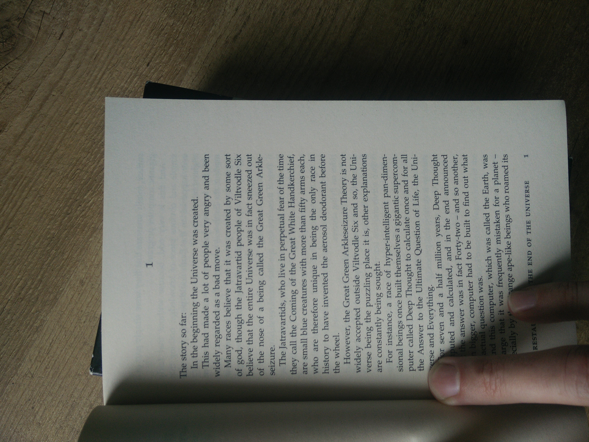

```{r setup, include=FALSE}
knitr::opts_chunk$set(echo = TRUE)
```


In this project I will analyze the books from the Hitchhikers Guide to the Galaxy.

in no particular order

- [x] sentiment per book / chapter, is it getting darker and darker? [Sentiment](sentiment.md)
- [] overal word embeddings (still not tired of them! ) in Douglas Adams books.
- [x] tf-idf of books, what is more typical for every book
- [x] n-grams and correlations: a web of connections between words [n-grams](n-grams.md)
- [] 



