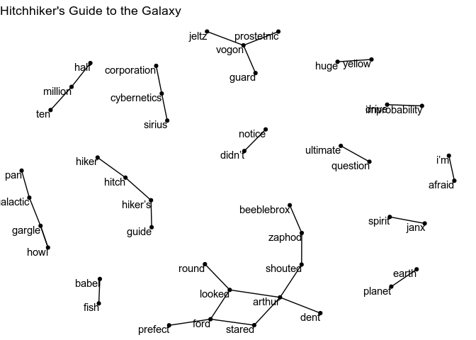
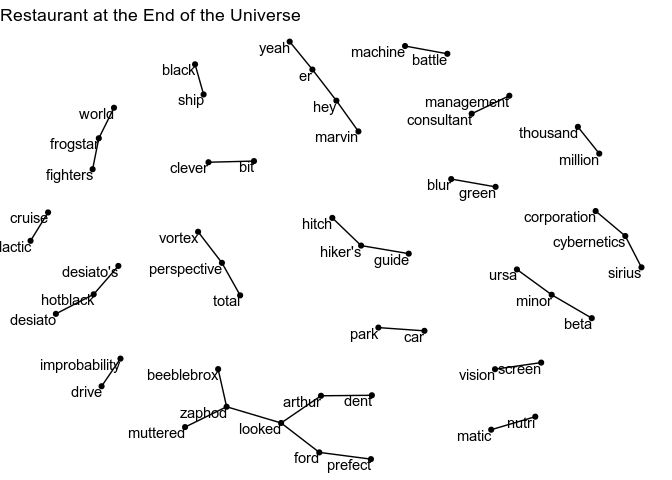
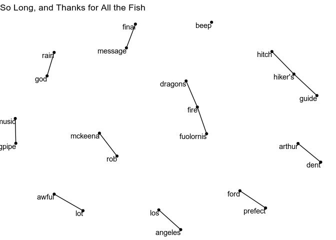

n-grams
================
Roel M. Hogervorst
June 15, 2018

``` r
source("R/01_load_data.R")
```

    ## ── Attaching packages ──────────────────────────────────────────────────────── tidyverse 1.2.1 ──

    ## ✔ ggplot2 2.2.1.9000     ✔ purrr   0.2.5     
    ## ✔ tibble  1.4.2          ✔ dplyr   0.7.5     
    ## ✔ tidyr   0.8.1          ✔ stringr 1.3.1     
    ## ✔ readr   1.1.1          ✔ forcats 0.3.0

    ## ── Conflicts ─────────────────────────────────────────────────────────── tidyverse_conflicts() ──
    ## ✖ dplyr::filter() masks stats::filter()
    ## ✖ dplyr::lag()    masks stats::lag()

``` r
library(tidytext)
library(dplyr)
library(ggraph)
library(tidygraph)
```

    ## 
    ## Attaching package: 'tidygraph'

    ## The following object is masked from 'package:stats':
    ## 
    ##     filter

``` r
HHGTTG_trigrams <- HHGTTG %>%
  unnest_tokens(trigram, content, token = "ngrams", n = 3) %>%
  separate(trigram, c("word1", "word2", "word3"), sep = " ") %>%
  filter(!word1 %in% stop_words$word,
         !word2 %in% stop_words$word,
         !word3 %in% stop_words$word) %>%
  count(word1, word2, word3, sort = TRUE)
HHGTTG_trigrams
```

    ## # A tibble: 6,990 x 4
    ##    word1      word2       word3           n
    ##    <chr>      <chr>       <chr>       <int>
    ##  1 hitch      hiker's     guide          32
    ##  2 sirius     cybernetics corporation    17
    ##  3 hitch      hiker’s     guide          15
    ##  4 total      perspective vortex         13
    ##  5 pan        galactic    gargle         12
    ##  6 ursa       minor       beta            9
    ##  7 galactic   gargle      blaster         8
    ##  8 prostetnic vogon       jeltz           8
    ##  9 beep       beep        beep            7
    ## 10 quentulus  quazgar     mountains       7
    ## # ... with 6,980 more rows

We can also visualise the biwords.

``` r
HHGTTG_bigrams <- HHGTTG %>%
  unnest_tokens(bigram, content, token = "ngrams", n = 2) %>%
    count(book, bigram) %>%
  bind_tf_idf(bigram, book, n) %>% 
  separate(bigram, c("word1", "word2"), sep = " ") %>%
  filter(!word1 %in% stop_words$word,
         !word2 %in% stop_words$word)

HHGTTG_graph_1 <- HHGTTG_bigrams %>% 
    filter(book == "Hitchhiker's Guide to the Galaxy") %>% 
    filter(n > 5) %>%
    select(word1, word2, book, n:tf_idf) %>% 
    mutate(book_c = as.factor(book)) %>% 
    as_tbl_graph()
ggraph(HHGTTG_graph_1, layout = "fr") +
    geom_edge_link(aes(edge_width = n^2)) +
    geom_node_point() +
    geom_node_text(aes(label = name), vjust = 1, hjust = 1)+
    theme_void() +
    ggtitle("Hitchhiker's Guide to the Galaxy")
```



``` r
HHGTTG_graph_2 <- HHGTTG_bigrams %>% 
    filter(book == "Restaurant at the End of the Universe") %>% 
    filter(n > 5) %>%
    select(word1, word2, book, n:tf_idf) %>% 
    mutate(book_c = as.factor(book)) %>% 
    as_tbl_graph()
ggraph(HHGTTG_graph_2, layout = "fr") +
    geom_edge_link(aes(edge_width = n^2)) +
    geom_node_point() +
    geom_node_text(aes(label = name), vjust = 1, hjust = 1)+
    theme_void() +
    ggtitle("Restaurant at the End of the Universe")
```



``` r
HHGTTG_graph_3 <- HHGTTG_bigrams %>% 
    filter(book == "Life, the Universe and Everything") %>% 
    filter(n > 5) %>%
    select(word1, word2, book, n:tf_idf) %>% 
    mutate(book_c = as.factor(book)) %>% 
    as_tbl_graph()
ggraph(HHGTTG_graph_3, layout = "fr") +
    geom_edge_link(aes(edge_width = n^2)) +
    geom_node_point() +
    geom_node_text(aes(label = name), vjust = 1, hjust = 1)+
    theme_void()+
    ggtitle("Life, the Universe and Everything")
```


``` r
HHGTTG_graph_4 <- HHGTTG_bigrams %>% 
    filter(book == "So Long, and Thanks for All the Fish") %>% 
    filter(n > 5) %>%
    select(word1, word2, book, n:tf_idf) %>% 
    mutate(book_c = as.factor(book)) %>% 
    as_tbl_graph()
ggraph(HHGTTG_graph_4, layout = "fr") +
    geom_edge_link(aes(edge_width = n^2)) +
    geom_node_point() +
    geom_node_text(aes(label = name), vjust = 1, hjust = 1)+
    theme_void()+
    ggtitle("So Long, and Thanks for All the Fish")
```



Visualise the word connections
