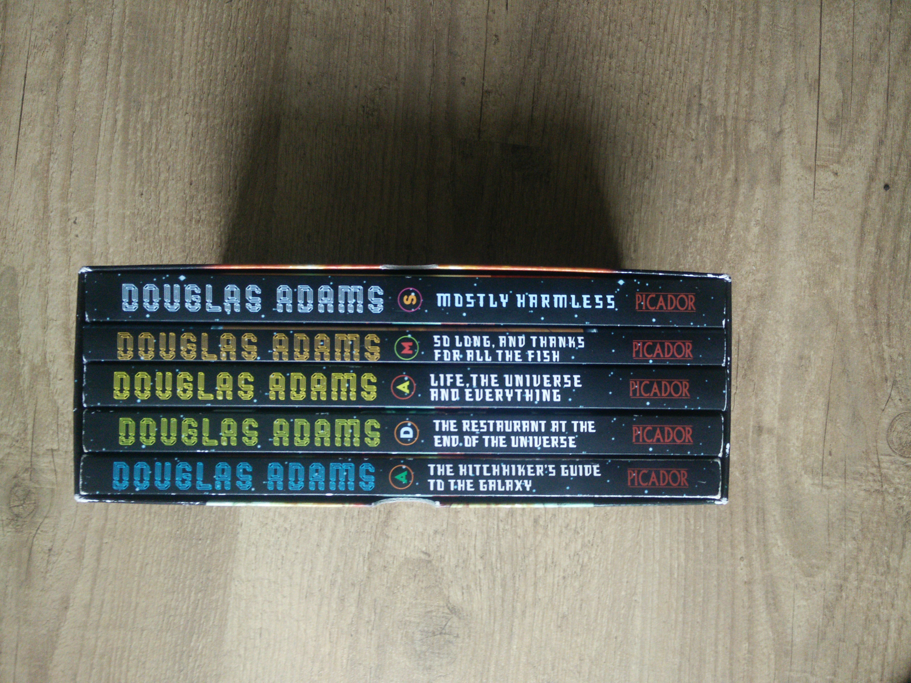
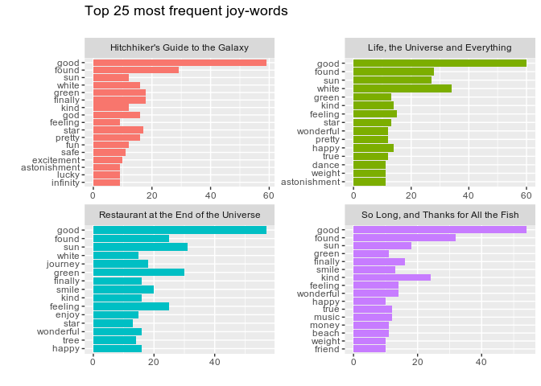
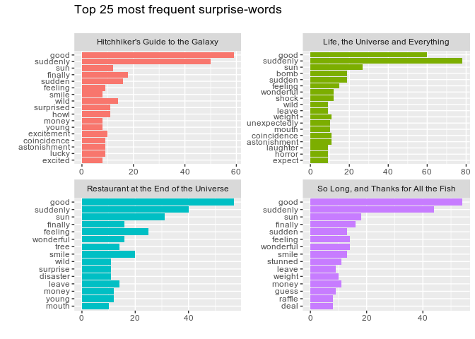
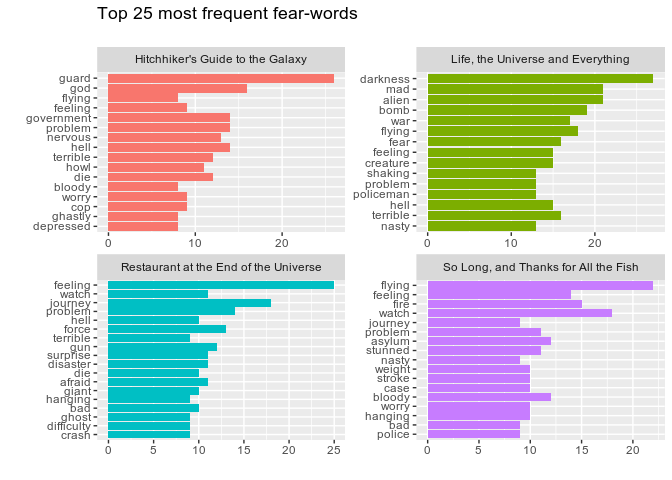
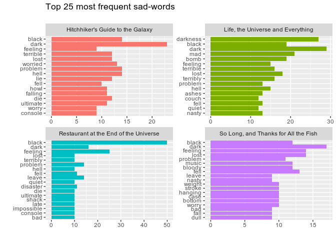
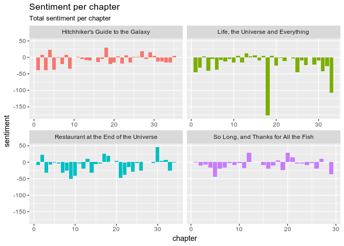
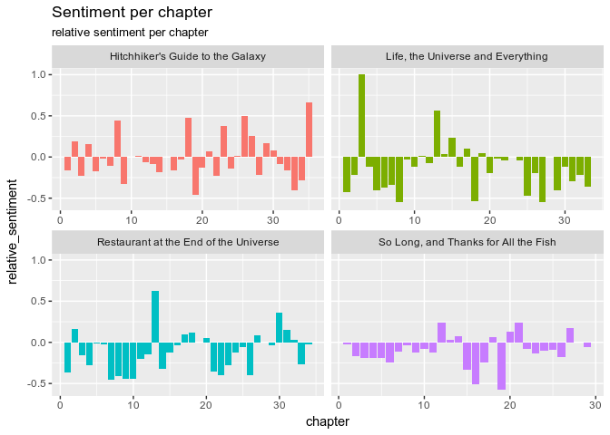

Sentiment Hitchhikers Guide trilogy
================

> “The ships hung in the sky in much the same way that bricks don't.” - Hitchhiker's Guide to the Galaxy

These are the beautiful words of 'Hitchhiker's Guide to the Galaxy', book one in the trilogy of five. Douglas Adams wrote in way that I really really like. Many many of the sentences make me laugh, it is a beautiful high paced advanture. Just check these quotes:

> “For a moment, nothing happened. Then, after a second or so, nothing continued to happen.”

a lovely anticlimax.



There many things we can do with the books. But in this case I will look at sentiment and common words.

Sentiment
---------

``` r
source("R/01_load_data.R")
```

    ## ── Attaching packages ──────────────────────────────────────────────────────── tidyverse 1.2.1 ──

    ## ✔ ggplot2 2.2.1.9000     ✔ purrr   0.2.5     
    ## ✔ tibble  1.4.2          ✔ dplyr   0.7.5     
    ## ✔ tidyr   0.8.1          ✔ stringr 1.3.1     
    ## ✔ readr   1.1.1          ✔ forcats 0.3.0

    ## ── Conflicts ─────────────────────────────────────────────────────────── tidyverse_conflicts() ──
    ## ✖ dplyr::filter() masks stats::filter()
    ## ✖ dplyr::lag()    masks stats::lag()

``` r
library(tidytext)
unnestedHHGTTG<- 
    HHGTTG %>% 
    group_by(book, chapter) %>% 
    unnest_tokens(output = "word",input = content, token = "words") %>% 
    ungroup()

# use afinn and numbers
# NRC surprise, fear, joy, sadness and count
joy <- get_sentiments("nrc") %>% 
    filter(sentiment == "joy")
surprise <- get_sentiments("nrc") %>% 
    filter(sentiment == "surprise")
fear <- get_sentiments("nrc") %>% 
    filter(sentiment == "fear")
sadness <- get_sentiments("nrc") %>% 
    filter(sentiment == "sadness")
```

Using the NRC sentiment corpus we can look at words that signal joy, surprise, fear or sadness.

``` r
unnestedHHGTTG %>% 
    inner_join(joy) %>%
    group_by(book) %>% 
    count(word, sort = TRUE) %>% 
    top_n(15, wt = n) %>% 
    ungroup() %>% 
    mutate(word = reorder(word, n)) %>%
    ggplot(aes(word, n, fill = book))+
    geom_col(show.legend = FALSE)+
    facet_wrap(~book,scales = "free")+
    coord_flip()+
    labs(
        title = "Top 25 most frequent joy-words",
        subtitle = "",
        x = "", y = ""
    )
```

    ## Joining, by = "word"



``` r
unnestedHHGTTG %>% 
    inner_join(surprise) %>%
    group_by(book) %>% 
    count(word, sort = TRUE) %>% 
    top_n(15, wt = n) %>% 
    ungroup() %>% 
    mutate(word = reorder(word, n)) %>%
    ggplot(aes(word, n, fill = book))+
    geom_col(show.legend = FALSE)+
    facet_wrap(~book,scales = "free")+
    coord_flip()+
    labs(
        title = "Top 25 most frequent surprise-words",
        subtitle = "",
        x = "", y = ""
    )
```

    ## Joining, by = "word"



``` r
unnestedHHGTTG %>% 
    inner_join(fear) %>%
    group_by(book) %>% 
    count(word, sort = TRUE) %>% 
    top_n(15, wt = n) %>% 
    ungroup() %>% 
    mutate(word = reorder(word, n)) %>%
    ggplot(aes(word, n, fill = book))+
    geom_col(show.legend = FALSE)+
    facet_wrap(~book,scales = "free")+
    coord_flip()+
    labs(
        title = "Top 25 most frequent fear-words",
        subtitle = "",
        x = "", y = ""
    )
```

    ## Joining, by = "word"



``` r
unnestedHHGTTG %>% 
    inner_join(sadness) %>%
    group_by(book) %>% 
    count(word, sort = TRUE) %>% 
    top_n(15, wt = n) %>% 
    ungroup() %>% 
    mutate(word = reorder(word, n)) %>%
    ggplot(aes(word, n, fill = book))+
    geom_col(show.legend = FALSE)+
    facet_wrap(~book,scales = "free")+
    coord_flip()+
    labs(
        title = "Top 25 most frequent sad-words",
        subtitle = "",
        x = "", y = ""
    )
```

    ## Joining, by = "word"



But we can also look at the sentiment per chapter, the bing corpus has words divided in positive and negative words. We can count the number of negative and positive words and check the result.

``` r
sentiment_chapter <- 
    unnestedHHGTTG %>% 
    inner_join(get_sentiments("bing")) %>%
    count(book, chapter, sentiment) %>%
    spread(sentiment, n, fill = 0) %>%
    mutate(
        sentiment = positive - negative,
        N_sent_words = positive+negative,
        relative_sentiment = sentiment / N_sent_words
        )
```

    ## Joining, by = "word"

``` r
sentiment_chapter %>% 
    ggplot(aes(chapter, sentiment, fill = book)) +
    geom_col(show.legend = FALSE) +
    facet_wrap(~book, ncol = 2, scales = "free_x")+
    labs(
        title = "Sentiment per chapter",
        subtitle = "Total sentiment per chapter"
    )
```



``` r
sentiment_chapter %>% 
    ggplot(aes(chapter, relative_sentiment, fill = book)) +
    geom_col(show.legend = FALSE) +
    facet_wrap(~book, ncol = 2, scales = "free_x")+
    labs(
        title = "Sentiment per chapter",
        subtitle = "relative sentiment per chapter"
    )
```


